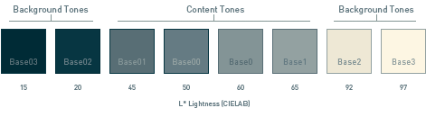

# solarizer
A utility which contains the default hexadecimal and RGB values for [solarized](https://ethanschoonover.com/solarized/) color values as well as the ability to convert any RGB color into a solarized-style theme by mimicking the color differences found in the `base` colors.

## Installation
`npm install --save solarizer`

## Usage
Here's an example of how one might create some solarized [react-native-really-awesome-button](https://github.com/rcaferati/react-native-really-awesome-button) buttons.

```Typescript
import { createBasesFromColor, rgb, rgbStrings as bases } from "./colors/Solarizer";
import { configuration, Recipient } from "./Configuration";
import { sendEmail } from "./Google";

const blue = createBasesFromColor(rgb.blue, "base01");
const red = createBasesFromColor(rgb.red, "base01");
const green = createBasesFromColor(rgb.green, "base01");
```
Then later...
```tsx
  render() {
    return (
      <View style={styles.root} >
        <AwesomeButton
          key="Clear Button"
          onPress={() => this.clear()}
          backgroundColor={this.state.busy ? bases.base01 : red.base01}
          backgroundActive={this.state.busy ? bases.base02 : red.base02}
          backgroundDarker={this.state.busy ? bases.base03 : red.base03}
          disabled={this.state.busy}
        >
          Clear
        </AwesomeButton>
        <AwesomeButton
          key="Submit Button"
          onPress={() => this.submit()}
          accessibilityLabel="Submit"
          backgroundColor={this.state.busy ? bases.base01 : green.base01}
          backgroundActive={this.state.busy ? bases.base02 : green.base02}
          backgroundDarker={this.state.busy ? bases.base03 : green.base03}
          disabled={this.state.busy}
        >
          Submit
        </AwesomeButton>
      </View >);
  }
}

```


## Detail
By calculating the d


